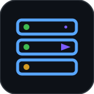
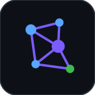
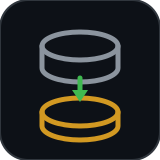
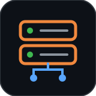

 

<h1>Kevin Ceciliano Gamboa</h1>

**Data &amp; AI Engineer** &nbsp;·&nbsp;  &nbsp;**[Procter &amp; Gamble](https://www.pg.com/)**

I build the automation, data pipelines and AI tooling behind order management and other organizations — and I'm the one who gets paged when they break.

 

I came into this through automation in 2023 and kept widening: first the workflows, then the platform that runs them, then the data they sit on, then the AI on top. What ties it together is that I stay responsible for things once they're in production — monitoring, incidents, root cause, the boring parts.

Most of what I build lives in a private enterprise repository, so this profile is coursework and side projects. The cards below are the real work.

 

## Experience

<table>
<tr>
<td width="50%" valign="top" align="center">
  
    
  <strong>Automation Execution Platform</strong>
    
  The runner my team uses as its <strong>production execution environment</strong>. Configuration-driven, so behaviour changes without a redeploy. Resource pre-flight that refuses to start a run that would crash the machine, per-run telemetry, an error classifier built from mining our historical production failures so every alert arrives with a category and a suggested action, retries, orphan-process cleanup, and email plus Teams alerting that renders from a structured payload instead of scraped HTML.
    
  
  
  
  
  
  
    
  
</td>

<td width="50%" valign="top" align="center">
  
    
  <strong>Order Management AI Tooling</strong>
    
  Production LLM tooling that reads customer order-change requests, interprets them against live ERP data and hands structured instructions to downstream automation — plus natural-language data agents that answer order questions in Teams and Outlook. I work the prompt, few-shot and schema layer, validate accuracy, and root-cause failures structurally: cluster them, find the one real cause, fix it at the right layer so the whole class can't recur. Also the semantic layer behind the Latin America data agent, including its governance check against the approved data dictionary.
    
  
  
  
  
    
  
  
</td>
</tr>

<tr>
<td width="50%" valign="top" align="center">
  
    
  <strong>SAP Golden Layer Pipeline</strong>
    
  The curated data layer everything downstream reads from. Databricks Jobs and PySpark over the SAP silver layer with <strong>change data capture</strong>, so each run processes only what actually changed instead of reloading the world. Around it: Microsoft Graph extraction pipelines pulling incrementally from enterprise mailboxes with delta queries, ETL workflows consolidating a long tail of enterprise sources, and the Power BI models the operational KPIs run on.
    
  
  
  
  
  
  
    
  
</td>

<td width="50%" valign="top" align="center">
  
    
  <strong>Metanoia Internacional</strong> · non-profit
    
  I've run the IT function of a non-profit since 2020 — the part of my work that isn't behind a corporate firewall. Provisioned a Linux VPS on Oracle Cloud from scratch, configured the server and a hosting control panel, migrated their WordPress and Moodle deployments onto it, and I keep DNS and the platforms running. Self-taught, small scale, and the reason I'm comfortable at a terminal on a box nobody else is watching.
    
  
  
  
  
  
    
  
</td>
</tr>
</table>

 

## The stuff I actually use

<table>
<tr>
<td valign="middle"><strong>Languages</strong></td>
<td>

</td>
</tr>
<tr>
<td valign="middle"><strong>Data &amp; BI</strong></td>
<td>

</td>
</tr>
<tr>
<td valign="middle"><strong>AI</strong></td>
<td>

</td>
</tr>
<tr>
<td valign="middle"><strong>Automation</strong></td>
<td>

</td>
</tr>
<tr>
<td valign="middle"><strong>Enterprise systems</strong></td>
<td>

</td>
</tr>
<tr>
<td valign="middle"><strong>Infrastructure &amp; tooling</strong></td>
<td>

</td>
</tr>
</table>

**How I use them:** change data capture &amp; incremental pipelines · medallion / golden-layer architecture · prompt and few-shot engineering · text-to-SQL grounding · semantic modelling &amp; ontology governance · LLM accuracy evaluation · human-in-the-loop AI controls · observability and failure taxonomies · root-cause analysis · incident response · UAT &amp; defect management · configuration-driven design · idempotent pipelines · PDCA

 

## Somewhere between the lines

The opinion I'd defend hardest: **knowing when not to use AI.** If a problem can be solved reliably with rules and a well-maintained mapping, it belongs there — not in a language model. I've pulled lookup logic *out* of LLMs and into plain deterministic Python specifically to cut hallucination risk and keep decisions explainable. AI is for the reasoning. It shouldn't be doing your joins.

The other one: fix the class, not the symptom. When something breaks, the interesting question isn't "how do I make this case pass" — it's "what structural thing made this whole family of cases possible."

I'm neurodivergent, which I think explains some of that. A lot of attention to detail, and enough analytical persistence to keep pulling on a thread when something doesn't add up.

 

<strong>Bachelor's in Informatics Engineering</strong> · UNED, Costa Rica

Always up for a conversation about data, AI or automation — <a href="mailto:ksceciliano@gmail.com">ksceciliano@gmail.com</a>

